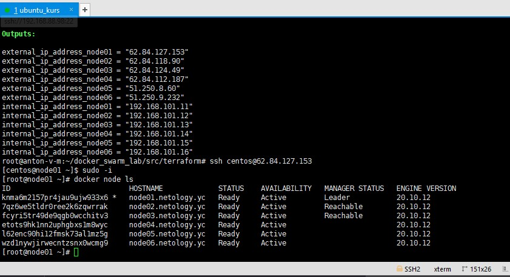
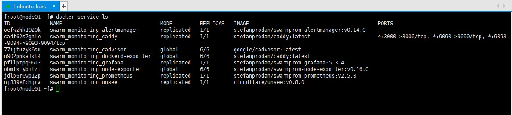

### Задача 1  
Дайте письменые ответы на следующие вопросы:

- В чём отличие режимов работы сервисов в Docker Swarm кластере: replication и global?
```
в режиме global сервисы распределяются на всех нодах
в режиме replicated сирвис запускается на указанном количестве узлов кластера
```

- Какой алгоритм выбора лидера используется в Docker Swarm кластере?
```
алгорит raft
есть 3 состояния Follower, Candidate, Leader.
узлы отправляют запрос на голосование по истечению таймаута (150-300мс), узел, который отправляет запрос становится кандидатом, после получения голосов становится лидером
далее Leader и Follower нроды обмениваются хартбитными сообщениями.

```

- Что такое Overlay Network?
```
overlay-сеть используется для взаимодействия docker-контейнером, расположенных на разных хостах
```


### Задача 2  
Создать ваш первый Docker Swarm кластер в Яндекс.Облаке

Для получения зачета, вам необходимо предоставить скриншот из терминала (консоли), с выводом команды:

`docker node ls`

  

### Задача 3  
Создать ваш первый, готовый к боевой эксплуатации кластер мониторинга, состоящий из стека микросервисов.

Для получения зачета, вам необходимо предоставить скриншот из терминала (консоли), с выводом команды:

`docker service ls`

